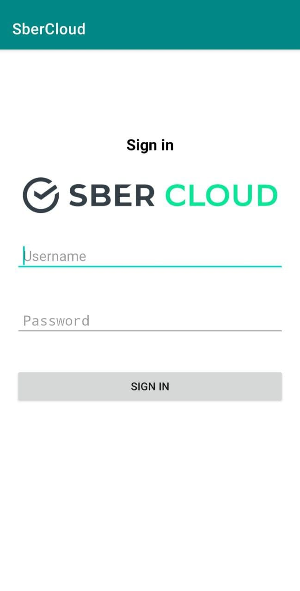
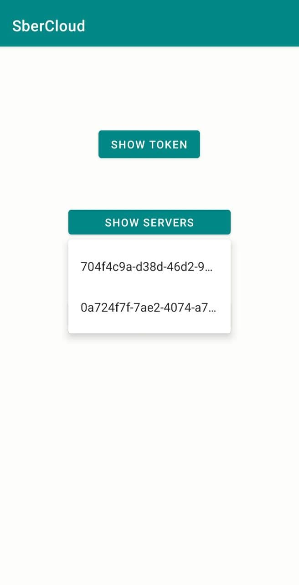
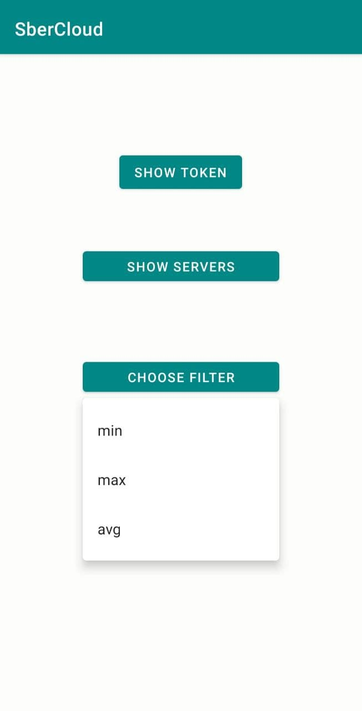
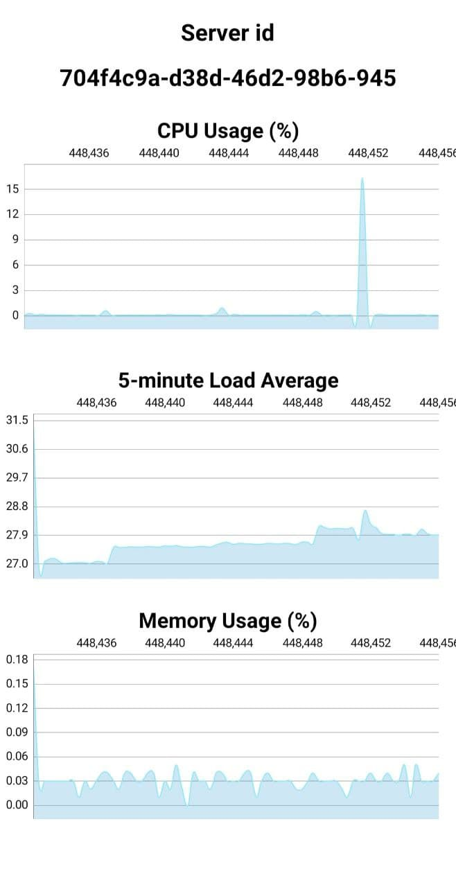

# SberCloud

## Запуск
В **release** нужно выбрать последний релиз и скачать **.apk** файл.

## Описание
 - Приложение написано для устройств на **Android**
 - Реализует интерфейс **SberCloud Advanced** и помогает мониторить параметры виртуальных машин
 - Запросы создаются при помощи **CloudEye API**
 
На главном экране пользователь может ввести свой логин и пароль от **SberCloud**

**Show token** позволяет получить аутентификационный токен, полученный при логине  
При нажатии на **Show servers** откроется список созданных **Elastic Cloud Server**

При нажатии на **Choose filter** откроется список доступных фильтров:
 - **Max** - Cloud Eye calculates the maximum value of metric data within a rollup period.
 - **Min** - Cloud Eye calculates the minimum value of metric data within a rollup period.
 - **Sum** - Cloud Eye calculates the sum of metric data within a rollup period.
 

В выпадающем списке серверов можно выбрать конкретный и перейти по нему.  
Откроются три графика, описывающие метрики: **CPU Usage**, **5-minute Load Average**, **Memory Usage**

Запрос API создаётся каждый раз при выборе сервера в **Show servers**
